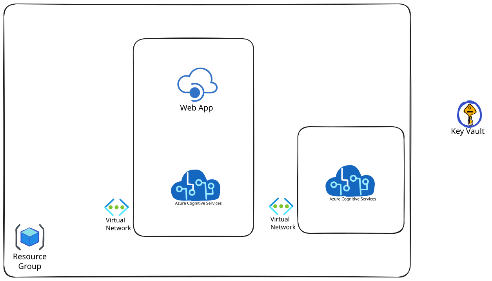

# AIF APIM — Azure AI Foundry with API Management

Infrastructure-as-Code (Bicep) for deploying Azure AI Foundry (AIServices)
instances behind an Azure API Management gateway. Originally developed for
the National Synchrotron Light Source II (NSLS-II) at Brookhaven National
Laboratory; forks welcome.

This repository was originally derived from Microsoft's
[AzureOpenAI-with-APIM](https://github.com/microsoft/AzureOpenAI-with-APIM)
sample and has since been substantially restructured and extended
(multi-region failover, Anthropic API surface, private networking, custom
TLS, token-usage analytics, IP allow-listing). See [`LICENSE`](LICENSE) for
the MIT terms inherited from that project, with an added BNL copyright
notice.

## Usage

You can call models deployed behind APIM using standard OpenAI and Anthropic Python SDKs.

### Prerequisites

- Python 3.8+
- `pip install "openai>=1.66.0" anthropic rich` — `openai>=1.66.0` is required
  for the v1 Responses API example; earlier versions suffice for Chat Completions only
- Set your APIM subscription key: `export AIFAPIM_API_KEY=...`
- The gateway supports HTTP/2; clients using `httpx` need `pip install httpx[h2]` and `http2=True` to negotiate it.

### Example: Query OpenAI-compatible model (GPT, Llama, etc.)

```python
from openai import AzureOpenAI
import os

endpoint = f"https://{os.environ['AIFAPIM_HOST']}"
deployment_name = "gpt-4.1-mini"  # or any deployed model name
api_version = "2024-10-21"
api_key = os.environ["AIFAPIM_API_KEY"]

client = AzureOpenAI(
    base_url=f"{endpoint}/deployments/{deployment_name}",
    api_key="placeholder",
    default_headers={"x-api-key": api_key},
    api_version=api_version,
)

response = client.chat.completions.create(
    model=deployment_name,
    messages=[
        {"role": "system", "content": "You are an AI assistant."},
        {"role": "user", "content": "What is the National Synchrotron Light Source II?"},
    ],
)
print(response.choices[0].message.content)
```

### Example: Query Anthropic-compatible model (Claude)

> **Path note:** The official Anthropic SDK appends `/v1/messages` to
> `base_url` internally, so set `base_url=https://{AIFAPIM_HOST}/anthropic`.
> Raw HTTP clients and OpenCode (which do not append `/v1`) should use
> `https://{AIFAPIM_HOST}/anthropic/v1` instead.

```python
from anthropic import Anthropic
import os

endpoint = f"https://{os.environ['AIFAPIM_HOST']}"
deployment_name = "claude-sonnet-4-5"  # or any deployed Claude model
api_key = os.environ["AIFAPIM_API_KEY"]

client = Anthropic(
    base_url=f"{endpoint}/anthropic",
    api_key=api_key
)

response = client.messages.create(
    model=deployment_name,
    max_tokens=800,
    system="You are an AI assistant.",
    messages=[{"role": "user", "content": "What is the National Synchrotron Light Source II?"}],
)
print(response)
```

### Example: Query model via OpenAI v1 Responses API

The `azure-openai-v1-messages-api` exposes the OpenAI Responses API
(`POST /openai/v1/responses`). This uses a different schema to Chat
Completions — input is an array of messages and output is returned in
`response.output`. Requires `openai>=1.66.0`.

```python
from openai import OpenAI
import os

endpoint = f"https://{os.environ['AIFAPIM_HOST']}"
deployment_name = "gpt-4.1-mini"  # or any deployed model name
api_key = os.environ["AIFAPIM_API_KEY"]

client = OpenAI(
    base_url=f"{endpoint}/openai",
    api_key="placeholder",
    default_headers={"x-api-key": api_key},
)

response = client.responses.create(
    model=deployment_name,
    input=[
        {"role": "system", "content": "You are an AI assistant."},
        {"role": "user", "content": "What is the National Synchrotron Light Source II?"},
    ],
)
print(response.output[0].content[0].text)
```

### Example: OpenCode configuration

The `examples/opencode.json` file contains a ready-to-use
[OpenCode](https://opencode.ai) configuration that connects to both the
Azure OpenAI and Anthropic APIs through this APIM gateway. Copy it to your
OpenCode config location:

```bash
# Per-project (in your project root):
cp examples/opencode.json opencode.json

# Global (user-wide):
cp examples/opencode.json ~/.config/opencode/opencode.json
```

Set the required environment variables before starting OpenCode:

```bash
export AIFAPIM_HOST=<gateway-hostname>
export AIFAPIM_API_KEY=<your-subscription-key>
opencode
```

The config registers two providers; the `models` arrays below reflect
`examples/opencode.json` as shipped (the model list from the original
deployment, kept as a realistic example). **Edit the `models` arrays to match
the deployments you provisioned in your `aifapim-<env>.bicepparam`** — only
deployment names that actually exist behind the gateway will resolve.

| Provider key        | npm package         | Models (as shipped in `examples/opencode.json`) |
|---------------------|---------------------|-------------------------------------------------|
| `aifapim-openapi`   | `@ai-sdk/openai`    | GPT-4.1, GPT-4.1 Mini                           |
| `aifapim-anthropic` | `@ai-sdk/anthropic` | Claude Sonnet 4.5, Claude Haiku 4.5             |

Both providers authenticate using `{env:AIFAPIM_API_KEY}` passed as the
`x-api-key` header — no provider API key is required. The gateway hostname is
read from `{env:AIFAPIM_HOST}`, making it easy to switch between dev and prod
by changing a single environment variable.

For the full OpenCode configuration reference, see the
[OpenCode config docs](https://opencode.ai/docs/config/).

See `examples/test-apim.py` for a full script with Markdown rendering and more advanced usage.

## Architecture



- **Multi-region**: Two AI Foundry accounts with private endpoints in separate VNets, peered together.
- **Private networking**: AI Foundry endpoints are disabled for public access; APIM reaches them via private endpoints and shared private DNS zones.
- **Managed Identity auth**: APIM authenticates to AI Foundry using its system-assigned managed identity (Azure AI User / Cognitive Services OpenAI User roles).
- **Custom domains**: APIM gateway uses TLS certificates from Azure Key Vault (RBAC-based), with InCommon CA certificates in the trust store.
- **Retry & failover**: Automatic retry and failover from primary to secondary region.

## Prerequisites

- Azure CLI (`az`) with Bicep support
- A subscription with permissions to create Cognitive Services, APIM, VNets, and role assignments
- For custom domains: a Key Vault (RBAC-enabled) with PFX certificates stored as secrets

## Deployment

### Setting up a parameter file

`aifapim.example.bicepparam` is the canonical, in-repo parameter template.
Real `*.bicepparam` files are gitignored and must be created locally per
environment:

```bash
cp aifapim.example.bicepparam aifapim-prod.bicepparam
$EDITOR aifapim-prod.bicepparam   # fill in your values
```

The example file is fully commented; each parameter explains its purpose,
valid values, and any gotchas. Pay particular attention to `allowedClientIps`
(the inbound IP allow-list — RFC 5737 documentation IPs in the example will
not allow real traffic) and the `regions` / `modelDeployments` arrays.

### Deploy everything (AI Foundry + APIM)

```bash
az deployment group create \
  --resource-group <your-rg> \
  --template-file aifapim.bicep \
  --parameters aifapim-prod.bicepparam
```

> **Note:** Do **not** prefix `.bicepparam` files with `@` on the
> `--parameters` flag. That syntax is for raw JSON parameter files only and
> causes the CLI to fail with `unrecognized template parameter 'using
> 'aifapim.bicep'...'`. For `.bicepparam`, pass the path directly.

## Parameters

All parameters are documented inline in
[`aifapim.example.bicepparam`](aifapim.example.bicepparam). Copy that file to
`aifapim-<env>.bicepparam` and customize. The canonical source of truth for
parameter types, defaults, validators, and descriptions is the `@description`
blocks in [`aifapim.bicep`](aifapim.bicep).

Pay particular attention to:

- `allowedClientIps` — required (`@minLength(1)`); the inbound IP allow-list
  applied to all three APIM APIs. The example file ships RFC 5737
  documentation IPs that cannot route real traffic; replace them.
- `regions` and `modelDeployments` — nested arrays; outer indices of
  `modelDeployments` must align with `regions[*]`.
- `apimProductName` — the APIM product all three APIs are grouped under, and
  the App Insights custom-metric namespace.

## Repository Structure

```text
aifapim.bicep                   # Main deployment orchestrator
aifapim.example.bicepparam      # Parameter file template — copy and customize per environment
llm-token-usage-workbook.bicep  # Azure Monitor workbook for LLM token usage analytics
modules/
  aif.bicep                     # AI Foundry (AIServices) account + private endpoint
  aif-deployments.bicep         # Model deployments on AI Foundry
  api-management-private.bicep  # APIM instance with custom domains & CA certs
  api.bicep                     # API definitions, backends, product, diagnostics
  app-insights.bicep            # Application Insights
  cognitive-services-role.bicep # Cognitive Services / AI User RBAC for APIM system identity
  event-hub.bicep               # Event Hub for APIM logging
  keyvault-role.bicep           # Key Vault RBAC for APIM user-assigned identity
  llm-latency-alerts.bicep      # Scheduled-query latency alerts on ApiManagementGatewayLogs
  log-analytics-workspace.bicep # Log Analytics workspace
  network.bicep                 # APIM subnet
  private-dns-zone.bicep        # Private DNS zone for AI Foundry endpoints
  role.bicep                    # Generic role-assignment helper
  vnet.bicep                    # Virtual network
apim_policies/
  AOAI_Policy-Managed_Identity_with_Retry_MultiRegion.xml       # AOAI multi-region with failover
  OpenAIv1Messages_Policy-Managed_Identity_with_Retry_MultiRegion.xml  # AOAI v1 Messages multi-region with failover
  Anthropic_Policy-Managed_Identity_with_Retry_MultiRegion.xml  # Anthropic multi-region with failover
api_definitions/
  AzureOpenAI_inference_2024-10-21.yaml  # AOAI data-plane inference spec; vendored from azure-rest-api-specs
  AzureOpenAI_v1_Messages_OpenAPI.json   # AOAI v1 Messages OpenAPI spec imported into APIM
  AzureAnthropic_OpenAPI.json            # Anthropic OpenAPI spec imported into APIM
resources/                       # User-supplied CA PEMs loaded via loadTextContent
                                 # in the bicepparam file. Directory is gitignored
                                 # aside from a .gitkeep; see "Custom Domains & TLS".
examples/
  test-apim.py                  # Smoke-test against APIM using a subscription key
  opencode.json                 # Ready-to-use OpenCode configuration
```

## APIM Policies

All policies include:

- **IP filtering**: Inbound traffic is restricted to entries in the
  `allowedClientIps` parameter (see your `*.bicepparam` file; the canonical
  template is `aifapim.example.bicepparam`). Entries are either bare IPv4
  addresses or CIDR ranges; CIDR entries are expanded at deploy time via
  `parseCidr().firstUsable`/`lastUsable` (network and broadcast addresses are
  excluded). Typical contents are your client network range plus any
  provider-side egress IPs you need to allow (for example, the Anthropic
  egress IPs needed for `/anthropic/*` traffic on Foundry).
- **Managed Identity auth**: APIM authenticates to AI Foundry backends using its system-assigned identity
- **Retry & failover**: Retry on `404`, `429`, and `5xx`; on persistent failure, fail over from the primary backend to the secondary backend in the other region.
- **Token metrics**: Each LLM API policy emits per-request token metrics to
  Application Insights via `<llm-emit-token-metric>` (or the AOAI-specific
  `<azure-openai-emit-token-metric>` variant) with dimensions for API ID,
  Subscription ID, User ID, Product ID, and Model. The metric namespace is
  the configured `apimProductName`, substituted into the policy XML at deploy
  time via the `__METRIC_NAMESPACE__` sentinel. See **Token Usage Analytics**
  below.

### Authentication model

Authentication is two-hop and intentionally asymmetric:

- **APIM → AI Foundry**: APIM authenticates to each AI Foundry account using
  its **system-assigned managed identity**, granted `Cognitive Services OpenAI
  User` and `Azure AI User` roles on each account. No keys are stored.
- **Client → APIM**: End-users authenticate with an **APIM subscription key**
  passed via the `x-api-key` header, gated by the `allowedClientIps` IP allow-
  list described above.

Entra ID token validation (`<validate-azure-ad-token>`) is **intentionally not
configured** on any of the three APIM policies. Adding it on top of the
subscription-key flow would require every caller (interactive users, batch
jobs, OpenCode, the `examples/test-apim.py` smoke test) to also acquire an
AAD token for an APIM-fronting app registration — none of those flows are
wired up today. If dual-factor auth is ever required, plan to (1) register
and grant scopes for an APIM-fronting Entra app, (2) decide how non-
interactive callers obtain tokens (workload identity / device-code / client
credentials), (3) update the example clients to acquire and forward those
tokens, and (4) only then add
`<validate-azure-ad-token>` blocks to the policy XMLs.

## Token Usage Analytics

Token usage for the LLM APIs published through this gateway is captured in
two complementary sinks in the Log Analytics workspace / Application Insights
component connected to the APIM service:

1. **`ApiManagementGatewayLlmLog` table** — populated by APIM's LLM
   diagnostic setting (`apim-genai-gateway-logs`, defined in
   `modules/api-management-private.bicep`). Reliable for AOAI / OpenAI v1
   Messages prompt and completion tokens. **Has gaps for the Anthropic API**
   (see _Platform behaviors_ below).
2. **`AppMetrics` table** — populated by APIM's auto-emitted metrics, by
   the explicit `<llm-emit-token-metric>` / `<azure-openai-emit-token-metric>`
   policies on each API, and by the Anthropic policy's `<outbound>`
   `<emit-metric>` block. **Use this as the primary source for Anthropic token
   accounting.** All custom-policy metrics emitted by this repo land under the
   namespace given by `apimProductName` (the policy XML uses a
   `__METRIC_NAMESPACE__` sentinel substituted at deploy time).

### Source comparison

| Field                      | AOAI in `LlmLog`                                | Anthropic in `LlmLog`     | Anthropic in `AppMetrics`                                  |
|----------------------------|-------------------------------------------------|---------------------------|------------------------------------------------------------|
| Prompt tokens              | populated                                       | populated                 | populated (`Prompt Tokens` via `<llm-emit-token-metric>`)  |
| Completion tokens          | populated only when client sets `stream_options.include_usage=true` | **always 0** (streaming and non-streaming) | non-streaming: populated (`Anthropic Completion Tokens` from `<outbound>` policy). streaming: **unmeasurable** (SSE body cannot be parsed in `<outbound>`) |
| `ModelName` / `Model`      | populated on most streaming rows (~12/15 sample)| **always empty** (0/194)  | populated under `Properties.Model`                         |
| `DeploymentName`           | populated                                       | populated                 | (in `Properties.Model`)                                    |

### Per-subscription Anthropic token usage (last 7 days)

Read from `AppMetrics`, not from `ApiManagementGatewayLlmLog`. Prompt tokens
land under the unprefixed `Prompt Tokens` family (emitted via
`<llm-emit-token-metric>`); completion tokens land under
`Anthropic Completion Tokens` (emitted via the `<outbound>` `<emit-metric>`
block, non-streaming only):

```kusto
AppMetrics
| where TimeGenerated > ago(7d)
| extend
    SubscriptionId = tostring(parse_json(Properties)["Subscription ID"]),
    Model          = tostring(parse_json(Properties)["Model"]),
    ApiId          = tostring(parse_json(Properties)["API ID"])
| where ApiId == "anthropic-service-api"
| where Name in ("Prompt Tokens", "Anthropic Completion Tokens")
| summarize Tokens = sum(Sum) by SubscriptionId, Model, Name
| evaluate pivot(Name, sum(Tokens))
```

### Per-subscription AOAI token usage (last 7 days)

```kusto
AppMetrics
| where TimeGenerated > ago(7d)
| where Name in ("Prompt Tokens", "Completion Tokens", "Total Tokens")
| extend
    SubscriptionId = tostring(parse_json(Properties)["Subscription ID"]),
    Model          = tostring(parse_json(Properties)["Model"]),
    ApiId          = tostring(parse_json(Properties)["API ID"])
| where ApiId in ("azure-openai-service-api", "azure-openai-v1-messages-api")
| summarize Tokens = sum(Sum) by SubscriptionId, Model, Name
| evaluate pivot(Name, sum(Tokens))
```

### Unified token usage across all APIs (last 7 days)

```kusto
AppMetrics
| where TimeGenerated > ago(7d)
| extend
    SubscriptionId = tostring(parse_json(Properties)["Subscription ID"]),
    Model          = tostring(parse_json(Properties)["Model"]),
    ApiId          = tostring(parse_json(Properties)["API ID"])
| extend Kind = case(
      Name == "Prompt Tokens", "Prompt",
      Name == "Completion Tokens" and ApiId != "anthropic-service-api", "Completion",
      Name == "Anthropic Completion Tokens", "Completion",
      "Skip")
| where Kind in ("Prompt", "Completion")
| summarize Tokens = sum(Sum) by SubscriptionId, ApiId, Model, Kind
| evaluate pivot(Kind, sum(Tokens))
```

The `case` clause picks the correct completion-token source per API:
unprefixed `Completion Tokens` for OpenAI/Llama (where APIM's auto-emit
populates it), and `Anthropic Completion Tokens` for Anthropic (emitted
explicitly by the Anthropic policy's `<outbound>` `<emit-metric>` block).
The unprefixed `Completion Tokens` value for Anthropic is excluded because
it is always 0.

### Azure Monitor Workbook

The maintained workbook lives in the **`aifapim-config` repo**
(`llm-token-usage-workbook.bicep`). Deploy it from there — see
`aifapim-config/AGENTS.md` §"Workbook deployment" for the full recipe.

The canonical workbook includes:
- Summary tiles (total prompt/completion/total tokens)
- Token usage by API, Model, and APIM Subscription
- Token usage over time (per subscription)
- Cost analytics tiles (per-model and per-subscription cost from Cost Management)
- Optional non-owner read access via an Azure AD group (Monitoring Reader)

This repo retains `llm-token-usage-workbook.example.bicep` as a **reference
snapshot** of the workbook as it stood before the move to `aifapim-config`. It is
not deployed as part of this repo and will diverge from the canonical version as
new features are added. Do not run `az deployment group create` against the example
file — use the canonical in `aifapim-config` instead.

> **Drift warning**: the 2026-06 incident (commit `b0c4b86`) was caused by
> deploying a stale workbook copy to prod while a newer version was in dev.
> Always deploy from the single canonical source in `aifapim-config`.

The workbook reads from `AppMetrics` rather than `ApiManagementGatewayLlmLog`
because the latter has empty `ModelName` for Anthropic streaming on classic-tier
APIM, and `CompletionTokens=0` for all Anthropic rows (streaming and non-streaming).

### Platform behaviors observed on classic-tier APIM (Developer SKU)

The following limitations have been verified on this deployment. They appear
to be APIM platform behavior on classic tiers; some may be addressed in v2
tiers per Microsoft's [AI gateway capabilities][aigw] documentation, which
notes that the Anthropic Messages API is "currently supported in API
Management v2 tiers":

1. **Anthropic `CompletionTokens` is always 0** in
   `ApiManagementGatewayLlmLog` for both streaming and non-streaming
   responses. APIM's classic-tier diagnostic does not parse Anthropic
   Messages API response payloads. The Anthropic policy XML compensates by
   reading `usage.output_tokens` from the response body in `<outbound>` and
   emitting an `Anthropic Completion Tokens` custom metric.
2. **Anthropic streaming completion tokens remain unmeasurable.** The
   `<outbound>` workaround above is gated on a `requestIsStream` flag because
   SSE-streamed responses cannot be parsed as a single JSON object via
   `context.Response.Body.As<JObject>()`. Streaming Anthropic rows show
   `Completion = 0` in the workbook.
3. **Anthropic streaming `ModelName` is always empty** in
   `ApiManagementGatewayLlmLog`. Use `DeploymentName` from the same row, or
   `Properties.Model` from `AppMetrics` (the `<llm-emit-token-metric>`
   policy on the Anthropic API extracts the model from the request body and
   emits it as a dimension).
4. **AOAI streaming `ModelName` is empty on a subset of rows**, correlating
   with whether the client requested `stream_options.include_usage=true`.

If accurate per-model token accounting in the unified `LlmLog` table is
critical for downstream tooling, options are:

- File an Azure support case referencing these symptoms and the official
  Anthropic Messages support note in the AI gateway docs.
- Migrate to a v2 tier (Standard v2 or Premium v2). No in-place migration
  exists; this requires a parallel deployment with manual config replication.
- Continue using the `AppMetrics` queries above, which already capture the
  data needed for billing and usage reporting (with the streaming-Anthropic
  completion-token caveat noted in item 2).

[aigw]: https://learn.microsoft.com/en-us/azure/api-management/genai-gateway-capabilities

### Foundry-side diagnostics

In addition to the APIM-managed `ApiManagementGatewayLogs` / `ApiManagementGatewayLlmLog` / `AppMetrics` tables, each AI Foundry account also writes its own diagnostic logs to the same Log Analytics workspace by default. This captures traffic that bypasses the gateway (Entra-ID-authenticated direct callers, internal Foundry portal usage) and management-plane events (account/deployment configuration changes).

Default-on categories: `Audit`, `AzureOpenAIRequestUsage`, and `AllMetrics`. The verbose `RequestResponse` (full request/response bodies) and `Trace` (internal traces) categories are off by default; flip them on per-deployment via `aifDiagnosticsEnableRequestResponse=true` and `aifDiagnosticsEnableTrace=true` when troubleshooting.

Foundry logs land in `AzureDiagnostics`, distinct from the APIM tables:

```kusto
AzureDiagnostics
| where TimeGenerated > ago(1h)
| where ResourceProvider == "MICROSOFT.COGNITIVESERVICES"
| summarize count() by Category, Resource, OperationName
```

## Custom Domains & TLS

APIM supports custom domain names with TLS certificates from Azure Key Vault. A
user-assigned managed identity is created and granted the **Key Vault Secrets
User** role before APIM is deployed, solving the chicken-and-egg problem where
APIM needs Key Vault access during creation.

Certificates must be stored as **secrets** in Key Vault (APIM reads the PFX from
the secret URL, not the certificate URL).

### Optional CA certificates

Two optional parameters install PEM-encoded CA certificates into APIM's
certificate store:

- `intermediateCaCert` → APIM `CertificateAuthority` store
- `rootCaCert` → APIM `Root` store

Both default to empty (skip). Because `loadTextContent()` runs at bicepparam
compile time, populate them in your `*.bicepparam` file rather than in the
Bicep template itself:

```bicep
param intermediateCaCert = loadTextContent('resources/<your-intermediate>.pem')
param rootCaCert         = loadTextContent('resources/<your-root>.pem')
```

The bundled `resources/` directory is gitignored aside from a `.gitkeep` —
drop your PEM files there (or any path you prefer, relative to the bicepparam
file) and uncomment the matching lines in `aifapim.example.bicepparam`. The
module currently installs at most one cert per store; the parameters are
singular strings, not arrays.

## Examples

### Smoke test via APIM with subscription key

With pixi (reproducible conda env; manifest in `examples/`):

```bash
export AIFAPIM_HOST=<gateway-hostname>
export AIFAPIM_API_KEY="<your-key>"
cd examples && pixi run example
# or, from the repo root:
#   pixi run --manifest-path examples/pixi.toml example
```

Or with a manually-managed Python:

```bash
export AIFAPIM_HOST=<gateway-hostname>
export AIFAPIM_API_KEY="<your-key>"
python examples/test-apim.py
```

### OpenCode configuration

See `examples/opencode.json` and the [OpenCode configuration](#example-opencode-configuration)
section above for the full setup.
